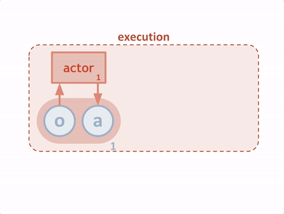

# Project Collaboration and Competition: Report

## Goal

In this report I discuss the solution to the third project "Collaboration and Competion" of the Udacity Deep Reinforcement Learning Nanodegree Program (DRLNP). The goal of the project is to train two agents to play tennis. 

The environmnent for this project Tennis is given by the Udacity team and it is similar to, but not identical to the Tennis environment on the [Unity ML-Agents GitHub page](https://github.com/Unity-Technologies/ml-agents/blob/master/docs/Learning-Environment-Examples.md).

In this environment, two agents control rackets to bounce a ball over a net. If an agent hits the ball over the net, it receives a reward of +0.1. If an agent lets a ball hit the ground or hits the ball out of bounds, it receives a reward of -0.01. Thus, the goal of each agent is to keep the ball in play.

The observation space consists of 8 variables corresponding to the position and velocity of the ball and racket. Each agent receives its own, local observation. Two continuous actions are available, corresponding to movement toward (or away from) the net, and jumping.

The task is episodic, and in order to solve the environment, the agents must get an average score of +0.5 (over 100 consecutive episodes, after taking the maximum over both agents). 

## Solution
### Algorithm Description

It has been realised that the traditional reinforcement learning approaches such as Q-learning or policy gradient are not performing so well in the multi-agent environments. Firstly, each agent’s policy is changing over the training process, and secondly, the environment becomes non-stationary when considered from the perspective of individual agents. This causes learning stability challenges and the past experience replay can not be used in the straightforward manner (Lowe et al. 2017).

The OpenAI team developed a new algorithm Multi-Agent Actor-Critic for Mixed Cooperative-Competitive Environments (MADDPG, Lowe et al. 2017) which extends a DDPG reinforcement learning algorithm (Lillicrap et al. 2016), taking inspiration from actor-critic reinforcement learning techniques. The MADDPG algorithm allows centralized learning and decentralized execution in multiagent environments, in which way the agents can learn to collaborate and compete with each other.

As explained by the OpenAI team in a [blog](https://openai.com/blog/learning-to-cooperate-compete-and-communicate/), in this new algorithm each agent is treated as an “actor” which gets an advice from a “critic” helping the actor to decide what actions to reinforce during the training process. The critic predicts the value - expected reward in the future - of an action in a particular state. The agent - the actor - uses then this value to update its policy, making the whole process more stable than directly using the reward. In order to train multiple agents acting in a globally-coordinated way the critics are modified to access the observations and actions of all the agents. This is schemtically shown in the figure below taken from the same [blog](https://openai.com/blog/learning-to-cooperate-compete-and-communicate/)

Given that each agent independently learns a centralized critic, the MADDPG algorithm can be used for any reward distributions between agents, including adversarial cases where with the opposing rewards. The MADDPG algorithm has been tested on a range of tasks: "two AI agents trying to go to a specific location and learning to split up to hide their intended location from the opposing agent; one agent communicating the name of a landmark to another agent; and three agents coordinating to travel to landmarks without bumping into each other" and it performed better than DDPG on all of them (https://openai.com/blog/learning-to-cooperate-compete-and-communicate/).

## Final set-up

The solution of this project is based on the implementation of the MADDPG algorithm as described above. The approach was to adopt the solution from the [second DRLNP project](https://github.com/MesecevaKci/deepRL_continuous_control) to the multi-agent environment. 

Given the MADPG algorithm, the implemented changes include a modification to the critic part of the deep network model (in model.py): the critic for each agent uses states observed and actions taken by the other agent during the training, while each actor has access to only its agent's observations and actions. 

The final layer weights and biases of both the actor and critic were initialized from a uniform distribution [−3×10−3,3×10−3].  As described in the DDQN paper, the reason for this was to garantee that the initial outputs for the policy and value estimates are close to zero. The rest of the network layers were initialized from uniform distributions [−1√f,1√f] where f is the fan-in of the layer. The actions in the Critic network were included in the second hidden layer. 

 The actor (policy) network maps states to actions with the following structure:
    State input: 24 units
    First hidden layer: 128 units with ReLU activation and batch normalization
    Second hidden layer: 128 units with ReLU activation and batch normalization
    Action output: 2 units with tanh activation

The critic (value) network maps (state, action) pairs to Q-values with the following structure:
    State input: 48 units (seen by both agents)
    First hidden layer: 128 nodes with ReLU activation and batch normalization
    Second hidden layer:  Action input 2 units * 2 + 128 units from the first hidden layer with ReLU activation 
    Q-value output: 1 node with ReLU activation

Hyperparameters (code MADDPG_agent.py)

Class MADDPG (implemented in MADDPG_agent.py) combines states, actions, rewards, next_states, and dones from both agents adding them to the sharedMemory (a ReplayBuffer shared by both agents) and has an "act" function for two DDPG agents.

Hyperparameters as in LINK:

BUFFER_SIZE = int(1e5)  # replay buffer size
BATCH_SIZE = 128        # minibatch size
GAMMA = 0.99            # discount factor
TAU = 1e-3              # for soft update of target parameters
LR_ACTOR = 1e-4         # learning rate of the actor 
LR_CRITIC = 1e-4        # learning rate of the critic
WEIGHT_DECAY = 0        # L2 weight decay
SIGMA = 0.1             # Ornstein-Uhlenbeck noise parameter
THETA = 0.15            # Ornstein-Uhlenbeck noise parameter
EPSILON = 1.0           # explore to exploit noise process added to act function in class Agent
EPSILON_DECAY = 1e-6 # decay rate for noise process

Importing the content from model.py and MADDPG_agent.py to the notebook Tennis.ipynb and running it, I have solved the environment  in 2868 episodes, as shown below:
RESULTING FIGURE 

This was a typical learning behaviour: the agents learn very slowly with the score around zero for >1000 episodes and then there is a sudden rise with the average score reaching 0.5. As a test I have also run the expriment longer after reaching the average score 0.5. I have seen that the score was increasing even further, however, the learning process became very slow and I have not run the expriment long enough to verify whether the learning would continue/plato or decrease again. 

##Future work

In order to improve the performance of the network one could try the following techniques:

1. More systematic exploration of the hyperparameters - in this work I have reused the parameters from another DDPG project. 
2. Implement prioritized Experience Replay
3. Test other methods and algorithms for multi-agent environments: multi-agent PPO or multi-agent DQN. 

##References
Lowe et al. 2017: https://papers.nips.cc/paper/7217-multi-agent-actor-critic-for-mixed-cooperative-competitive-environments.pdf
Lillicrap et al. 2016, https://arxiv.org/pdf/1509.02971.pdf
https://github.com/Unity-Technologies/ml-agents/blob/master/docs/Learning-Environment-Examples.md
https://github.com/MesecevaKci/deepRL_continuous_control
